# Release Guide

This chart uses **fully automated releases** - just push a tag and everything happens automatically!

## 🚀 Quick Start: Creating a New Release

### Option 1: Use the GitHub Actions UI (Recommended)

1. Go to **Actions** tab in GitHub
2. Click **Prepare Release** workflow
3. Click **Run workflow**
4. Enter the version (e.g., `1.0.1`)
5. Click **Run workflow**

**Done!** The automation will:

- ✅ Update `Chart.yaml` with the new version
- ✅ Commit the change
- ✅ Create and push the git tag
- ✅ Trigger the release workflow automatically

### Option 2: Manual Git Commands

```bash
# 1. Update Chart.yaml version manually
sed -i 's/^version:.*/version: 1.0.1/' Chart.yaml

# 2. Commit and push
git add Chart.yaml
git commit -m "chore(release): bump chart version to 1.0.1"
git push origin main

# 3. Create and push tag
git tag -a v1.0.1 -m "Release v1.0.1"
git push origin v1.0.1
```

## 🤖 What Happens Automatically

When you push a tag (e.g., `v1.0.1`), the release workflow automatically:

1. **Lints & Tests** the chart
2. **Updates Chart.yaml** with version from tag
3. **Updates dependencies** (Azure exporters, Blackbox exporter)
4. **Packages** the chart as `monitoring-stack-1.0.1.tgz`
5. **Creates GitHub Release** with release notes and chart package
6. **Updates gh-pages** branch with new Helm repository index
7. **Makes chart available** via Helm repository

## 📋 Version Numbering (Semantic Versioning)

Use semantic versioning for your tags:

- **Patch** (`v1.0.0` → `v1.0.1`): Bug fixes, minor updates
- **Minor** (`v1.0.0` → `v1.1.0`): New features, backward compatible
- **Major** (`v1.0.0` → `v2.0.0`): Breaking changes

**Important**: Always use the `v` prefix for tags (e.g., `v1.0.1`, not `1.0.1`)

## 🔍 Release Workflow Diagram

```mermaid
graph TB
    A[Push tag v1.0.1] --> B[Lint & Test Job]
    B --> C{Tests Pass?}
    C -->|Yes| D[Release Job]
    C -->|No| E[❌ Stop]
    D --> F[Extract version: 1.0.1]
    F --> G[Update Chart.yaml]
    G --> H[Package chart]
    H --> I[Create GitHub Release]
    I --> J[Update gh-pages]
    J --> K[✅ Chart Available]
```



## ⚡ Quick Release Commands

### Patch Release (Bug Fixes)

```bash
git tag -a v1.0.1 -m "Release v1.0.1"
git push origin v1.0.1
```

### Minor Release (New Features)

```bash
git tag -a v1.1.0 -m "Release v1.1.0 - New exporters added"
git push origin v1.1.0
```

### Major Release (Breaking Changes)

```bash
git tag -a v2.0.0 -m "Release v2.0.0 - Breaking: New configuration structure"
git push origin v2.0.0
```

## 🔄 Release Workflow

1. **Development**

   ```bash
   git checkout -b feature/new-exporter
   # Make changes
   git commit -m "feat: add postgres exporter"
   git push origin feature/new-exporter
   ```

2. **Merge to Main** (via PR)

   ```bash
   # PR is reviewed and merged
   ```

3. **Create Release**

   ```bash
   git checkout main
   git pull origin main
   git tag -a v1.2.0 -m "Release v1.2.0 - Add PostgreSQL exporter"
   git push origin v1.2.0
   ```

4. **Verify Release** (~2 minutes later)
   - Check: https://github.com/CMCS-Norway/monitoringHelmTemplate/releases
   - Test: `helm repo update && helm search repo cmcs-monitoring`

## 📝 Release Notes Template

```bash
git tag -a v1.2.0 -m "Release v1.2.0

New Features:
- Add PostgreSQL exporter support
- Enhanced monitoring for Azure SQL

Bug Fixes:
- Fix Fortigate scrape timeout
- Correct blackbox probe configuration

Dependencies:
- Update azure-keyvault-exporter to 1.0.13
"

git push origin v1.2.0
```

## ❌ Deleting/Fixing a Release

If you made a mistake:

```bash
# Delete tag locally and remotely
git tag -d v1.0.1
git push origin :refs/tags/v1.0.1

# Delete the GitHub Release manually (via web UI)
# Then create the correct tag
git tag -a v1.0.1 -m "Release v1.0.1 (corrected)"
git push origin v1.0.1
```

## 🎯 Pre-Release Checklist

Before creating a tag:

- [ ] All changes merged to `main`
- [ ] Tests passing (`helm lint`, `helm template`)
- [ ] Documentation updated (README, HELM_VALUES.md)
- [ ] CHANGELOG updated (if maintained)
- [ ] Dependencies up to date

## 🤖 Automated Processes

What's automated:

- ✅ Chart.yaml version update
- ✅ Chart packaging
- ✅ GitHub Release creation
- ✅ Helm repository publishing
- ✅ Dependency updates (via Renovate)

What requires manual action:

- ⚠️ Deciding version number
- ⚠️ Creating git tag
- ⚠️ Writing release notes

## 🔗 Related Documentation

- [Chart.yaml Specification](https://helm.sh/docs/topics/charts/#the-chartyaml-file)
- [Semantic Versioning](https://semver.org/)
- [GitHub Releases](https://docs.github.com/en/repositories/releasing-projects-on-github/managing-releases-in-a-repository)
